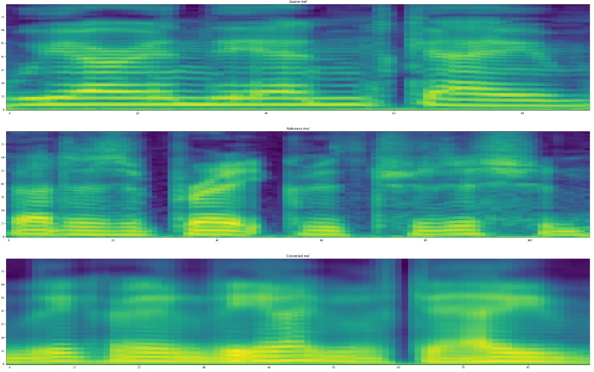

# VQVC-Pytorch
ONE-SHOT VOICE CONVERSION BY VECTOR QUANTIZATION
# Hesam Najafi
# 401141140111021
# How-to-run
1. Install dependencies.
    * python=3.7
    * [pytorch](https://pytorch.org/)=1.7 

    ```
    pip install -r requirements.txt
    ```

2. Download dataset and pretrained VocGAN model.
    * Please download [VCTK dataset](https://datashare.ed.ac.uk/handle/10283/3443) and edit ```dataset_path``` in ```config.py```.
    * Download [VocGAN pretrained model](https://github.com/Jackson-Kang/VQVC-Pytorch#pretrained-models)

3. Preprocess 
    * preprocess mel-spectrogram via following command:
    ```
    python prepro.py 1 1
    ```
    * first argument: mel-preprocessing
    * second argument: metadata split (You may change the portion of samples used on train/eval via ```data_split_ratio``` in ```config.py```)

4. Train the model
    ```
    python train.py
    ```
    * In ```config.py```, you may edit ```train_visible_device``` to choose GPU for training.
    * Same as paper, 60K steps are enough.
    * Training the model spends only 30 minutes.

5. Voice conversion
    * After training, point the source and reference speech for voice conversion. (You may edit ```src_paths``` and ```ref_paths``` in ```conversion.py```.)
    * As a result of conversion, you may check samples in directory ```results```.
    ```
    python conversion.py
    ```


# Inference results
* You may hear [audio samples](https://jackson-kang.github.io/opensource_samples/vqvc/).

* Visualization of converted mel-spectrogram
    - source mel(top), reference mel(middle), converted mel(bottom)



 
# Pretrained models
1.  [VQVC pretrained model](https://drive.google.com/file/d/1wiG8CyzNhq7dVZG3LZqCJ5bnoPTPS08a/view?usp=sharing)
* download pretrained VQVC model and place it in ```ckpts/VCTK-Corpus/```
2. [VocGAN pretrained model](https://drive.google.com/file/d/1nfD84ot7o3u2tFR7YkSp2vQWVnNJ-md_/view?usp=sharing) 
* download pretrained VocGAN model and place it in ```vocoder/vocgan/pretrained_models```

# Experimental Notes
* Trimming silence and stride of convolution are very important to transfer the style from reference speech.
* Unlike paper, I used [NVIDIA's preprocessing method](https://github.com/NVIDIA/tacotron2/blob/fc0cf6a89a47166350b65daa1beaa06979e4cddf/stft.py) to use pretrained [VocGAN](https://arxiv.org/pdf/2007.15256.pdf) model.
* Training is very unstable. (After 70K steps, perplexity of codebook is substantially decreased to 1.)
* **(Future work)** The model trained on [Korean Emotional Speech dataset](https://www.aihub.or.kr/keti_data_board/expression) is not completed yet. 

# References (or acknowledgements)
* [One-shot Voice Conversion by Vector Quantization](https://ieeexplore.ieee.org/document/9053854) (D. Y. Wu et. al., 2020)
* [VocGAN implementation](https://github.com/rishikksh20/VocGAN) by rishikksh20
* [NVIDIA's preprocessing method](https://github.com/NVIDIA/tacotron2/blob/fc0cf6a89a47166350b65daa1beaa06979e4cddf/stft.py)
